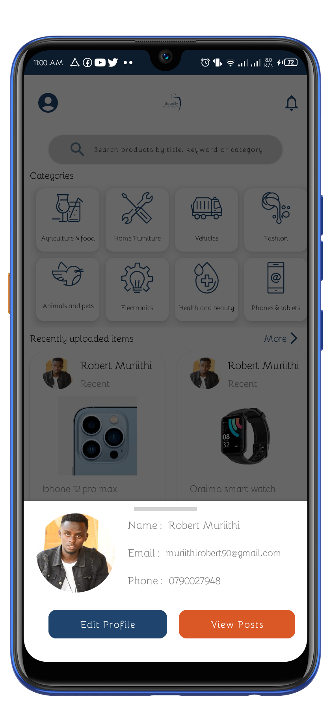
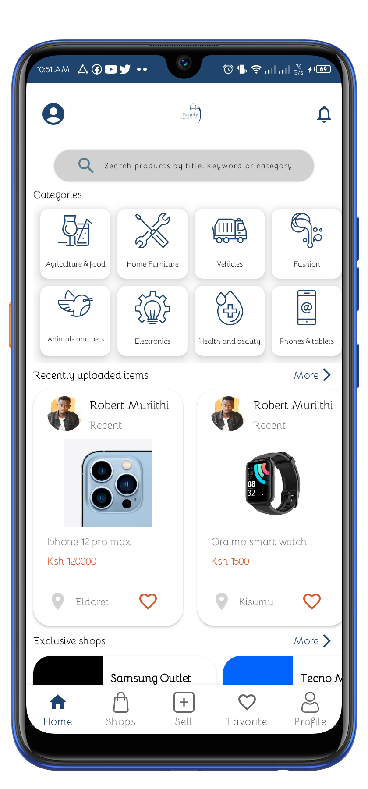
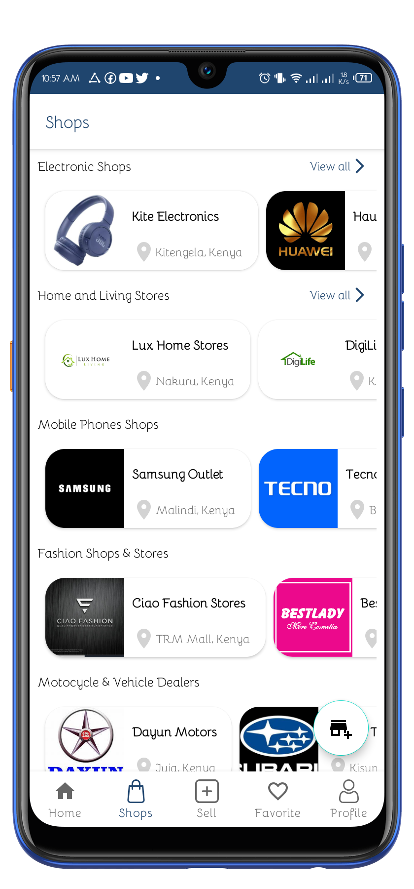
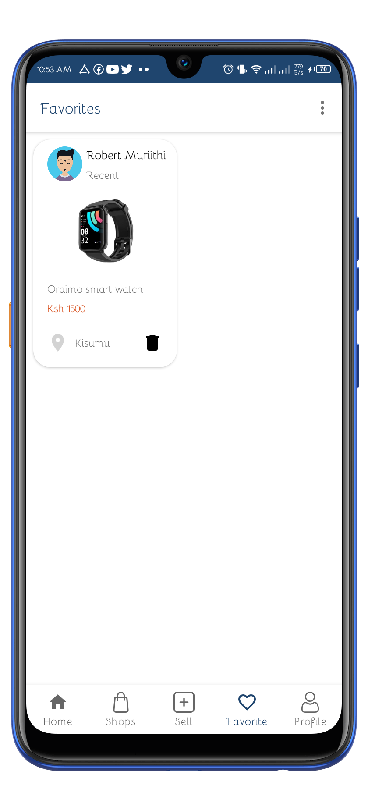
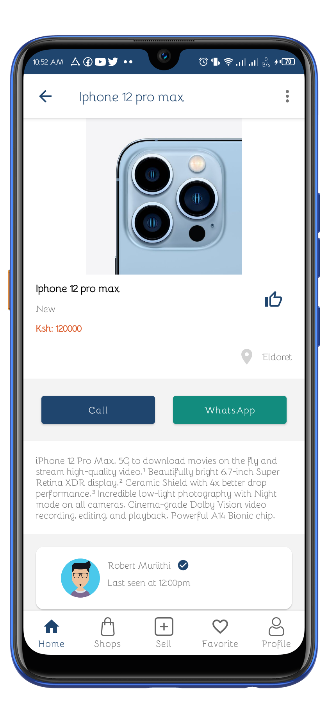
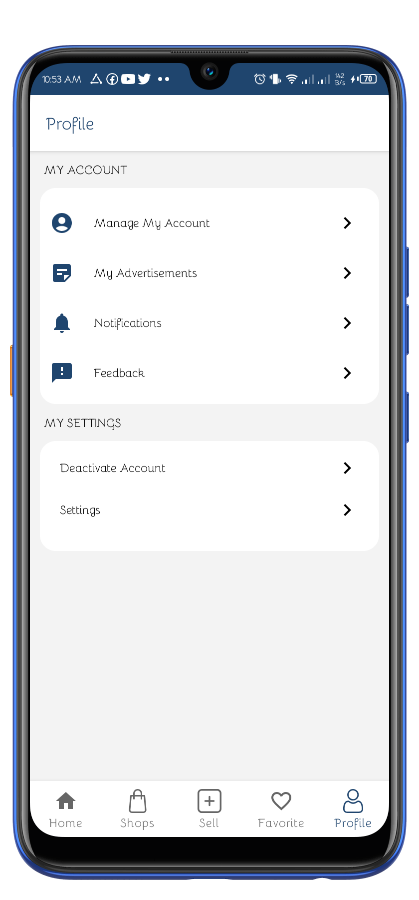

# Bagelly 🛒
A buying and selling app made using kotlin. A user can create his/her own shop online to sell products.

## Note:
- The app is still under development. Features like Search, App theme and few more features are not fully functional.

## Demo

  <table>
    <tr>
        <td></td>
        <td></td>   
    </tr>  
    <tr>
         <td></td>
        <td></td>  
    </tr>
    <tr>
         <td></td>
        <td></td>  
    </tr>
  </table>

## Tech Stack.
- [Kotlin](https://developer.android.com/kotlin) - Kotlin is a programming language that can run on JVM. Google has announced Kotlin as one of its officially supported programming languages in Android Studio; and the Android community is migrating at a pace from Java to Kotlin.
- [Firebase Firestore](https://firebase.google.com/docs/firestore) - Cloud Firestore is a flexible, scalable database for mobile, web, and server development from Firebase and Google Cloud
- [Glide](https://github.com/bumptech/glide) -  Glide is an Image Loader Library for Android developed by bumptech and is a library that is recommended by Google.
- Jetpack components:
    - [Android KTX](https://developer.android.com/kotlin/ktx.html) - Android KTX is a set of Kotlin extensions that are included with Android Jetpack and other Android libraries. KTX extensions provide concise, idiomatic Kotlin to Jetpack, Android platform, and other APIs.
    - [AndroidX](https://developer.android.com/jetpack/androidx) - Major improvement to the original Android [Support Library](https://developer.android.com/topic/libraries/support-library/index), which is no longer maintained.
    - [Lifecycle](https://developer.android.com/topic/libraries/architecture/lifecycle) - Lifecycle-aware components perform actions in response to a change in the lifecycle status of another component, such as activities and fragments. These components help you produce better-organized, and often lighter-weight code, that is easier to maintain.
    - [ViewModel](https://developer.android.com/topic/libraries/architecture/viewmodel) -The ViewModel class is designed to store and manage UI-related data in a lifecycle conscious way.
    - [LiveData](https://developer.android.com/topic/libraries/architecture/livedata) - LiveData is an observable data holder class. Unlike a regular observable, LiveData is lifecycle-aware, meaning it respects the lifecycle of other app components, such as activities, fragments, or services. This awareness ensures LiveData only updates app component observers that are in an active lifecycle state.
    - [SharedPrefences](https://developer.android.com/reference/android/content/SharedPreferences) - is a way in which one can store and retrieve small amounts of primitive data as key/value pairs to a file on the device storage such as String, int, float, Boolean that make up your preferences in an XML file inside the app on the device storage.
    - [Kotlin Coroutines](https://developer.android.com/kotlin/coroutines) - A concurrency design pattern that you can use on Android to simplify code that executes asynchronously.
    - [Dagger Hilt](https://developer.android.com/training/dependency-injection/hilt-android) - A dependency injection library for Android that reduces the boilerplate of doing manual dependency injection in your project.
- - CI/CD:
    - [GitHub Actions](https://github.com/features/actions) - GitHub Actions makes it easy to automate all your software workflows, now with world-class CI/CD. Build, test, and deploy your code right from GitHub. Make code reviews, branch management, and issue triaging work the way you want.
